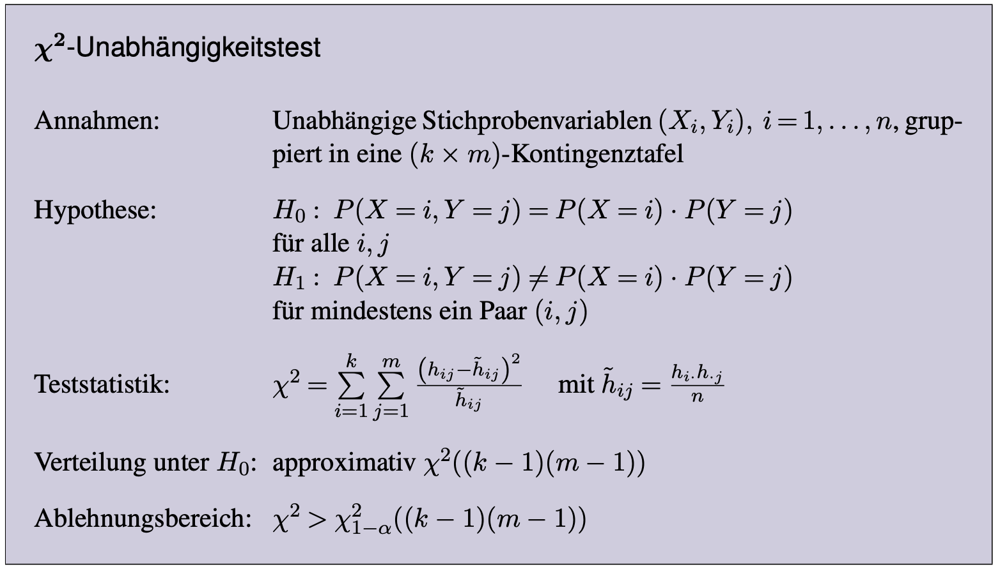
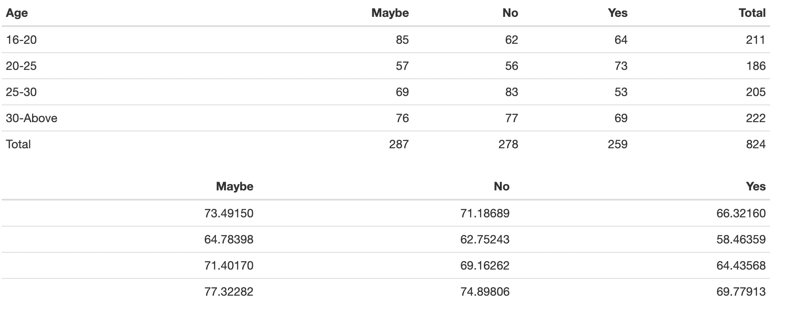
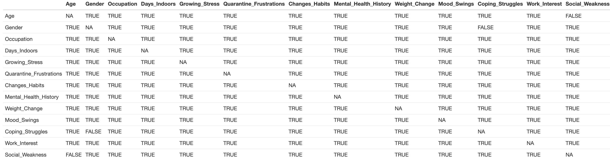

```{r setup, include=FALSE}
knitr::opts_chunk$set(echo = FALSE)
library(dplyr)
library(ggplot2)
library(tidyverse)
library(knitr)
library(kableExtra)
library(class)
library(fastDummies)
library(gridExtra)
MentalHealth = read_csv("../data/MentalHealthDataSet.csv")
```

## Datensatz

```{r, echo = FALSE}
kable(head(MentalHealth,4))
```

## Ziele

- Zusammenhänge finden (Unabhängigkeitsanalyse)
- Schlüssfolgerungen über Wohlbefinden ziehen
- Prognose erstellen 

## Explorative Datenanalyse

```{r , echo=FALSE, fig.show='hold'}
# Plot 1
df <- data.frame(
  Gender = MentalHealth$Gender
)
plot1 <- ggplot(df, aes(x = "", fill = Gender)) +
  geom_bar(width = 1, color = "white") +
  coord_polar("y", start = 0) +
  labs(title = "Verteilung der Geschlechter", fill = "Gender") +
  theme_void() +
  theme(legend.position = "right")
# Plot 2

df2 <- data.frame(
  Occupation = MentalHealth$Occupation
)
plot2 <- ggplot(df2, aes(x = "", fill = Occupation)) +
  geom_bar(width = 1, color = "white") +
  coord_polar("y", start = 0) +
  labs(title = "Verteilung der Tätigkeiten", fill = "Occupation") +
  theme_void() +
  theme(legend.position = "right")
# Plot 3
df3 <- data.frame(
  Age = MentalHealth$Age
)
plot3 <- ggplot(df3, aes(x = "", fill = Age)) +
  geom_bar(width = 1, color = "white") +
  coord_polar("y", start = 0) +
  labs(title = "Verteilung des Alters", fill = "Age") +
  theme_void() +
  theme(legend.position = "right")
# Plot 4
df4 <- data.frame(
  MentalHistory = MentalHealth$Mental_Health_History
)
plot4 <- ggplot(df4, aes(x = "", fill = MentalHistory)) +
  geom_bar(width = 1, color = "white") +
  coord_polar("y", start = 0) +
  labs(title = "Mental health history", fill = "MentalHistory") +
  theme_void() +
  theme(legend.position = "right")


grid.arrange(plot1, plot2, plot3, plot4, nrow = 2)
```

## Neue Varible fürs Wohlbefinden

```{r , echo=FALSE, results='asis'}
MentalHealth_wellness <- MentalHealth %>% 
  mutate(Mental_Unwellness = rowSums(select(., -Coping_Struggles, -Work_Interest, -Mental_Health_History) == "Yes") +
                         rowSums(select(.,Coping_Struggles,Work_Interest) == "No") + 
                         rowSums(select(., Mood_Swings) == "High") +
                         rowSums(. == "Maybe") / 2 +
                         rowSums(select(., Mood_Swings) == "Medium") / 2)
kable(head(MentalHealth_wellness,4))

```

## "Mental_Unwellness" Verteilung

```{r , echo=FALSE, fig.show='hold', out.width='49%'}
# Plot 1
plott1 <- ggplot(MentalHealth_wellness, aes(x = Mental_Unwellness)) +
  geom_histogram(binwidth = 1, fill = "blue", color = "black", alpha = 0.7) +
  labs(title = "Histogramm",
       x = "Psychological Unwellness",
       y = "Count") +
  theme_minimal()

#Plot 2
normal_density <- data.frame(x = seq(min(MentalHealth_wellness$Mental_Unwellness), max(MentalHealth_wellness$Mental_Unwellness), length = 1000),
                             y = dnorm(seq(min(MentalHealth_wellness$Mental_Unwellness), max(MentalHealth_wellness$Mental_Unwellness), length = 1000), mean = mean(MentalHealth_wellness$Mental_Unwellness), sd = sd(MentalHealth_wellness$Mental_Unwellness)))

plott2 <- ggplot(MentalHealth_wellness, aes(x = Mental_Unwellness)) +
  geom_density(fill = "blue", alpha = 0.7) +
  geom_line(data = normal_density, aes(x = x, y = y), color = "red", linewidth = 1) +
  labs(title = "Density Plot",
       x = "Psychological Unwellness",
       y = "Density") +
  theme_minimal()

grid.arrange(plott1, plott2, ncol = 2) 


```

## Unabhängigkeitsanalyse



## Kontingenztabelle mit den erwarteten Häufigkeiten


## 
```{r, echo=FALSE}
age_social_weakness_table <- MentalHealth %>%
  count(Age, Social_Weakness) %>%
  pivot_wider(names_from = Social_Weakness, values_from = n, values_fill = 0)

age_social_weakness_table <- age_social_weakness_table %>%
  mutate(Total = rowSums(select(.,"Maybe", "No", "Yes"))) %>%
  bind_rows(summarise(., across(where(is.numeric), sum),
                      across(where(is.character), ~'Total')))
v1 <- data.matrix(age_social_weakness_table[1:4,5])
v2 <- data.matrix(age_social_weakness_table[5,2:4])
exp_age_social_weakness_table <- v1 %*% v2 / as.numeric(age_social_weakness_table[5,5])

v <- data.matrix(age_social_weakness_table[1:4,2:4])
X <- sum((exp_age_social_weakness_table - v) ^ 2 / exp_age_social_weakness_table)
cat("X = ",X)
df <- (n_distinct(MentalHealth$Age) - 1) * (n_distinct(MentalHealth$Social_Weakness) - 1)
decision <- qchisq(0.95, df, lower.tail = TRUE) > X

cat("qchisq(o.95, df) = ",qchisq(0.95, df, lower.tail = TRUE))
cat("decision =", decision)
```

## Big Independence Table


##
```{r , echo=FALSE, fig.show='hold'}
# Plot 1
plott1 <- ggplot(MentalHealth, aes(x = MentalHealth$Coping_Struggles, fill = Gender)) +
  geom_bar(position = "dodge") +
  labs(title = "Coping Struggles by Gender",
       x = "Coping",
       y = "Count") +
  theme_minimal()

#Plot 2

plott2 <- ggplot(MentalHealth, aes(x = MentalHealth$Social_Weakness, fill = Age)) +
  geom_bar(position = "dodge") +
  labs(title = "Social Weakness by Age",
       x = "Social Weakness",
       y = "Count") +
  theme_minimal()


grid.arrange(plott1, plott2, nrow = 2) 


```

## Einfluss des Alters auf Wohlbefinden
```{r, echo=FALSE}

MentalHealth_wellness$Mental_Unwellness <- ifelse(MentalHealth_wellness$Mental_Unwellness > 4, 1, 0)

#Making chisq tests
chisq.test(MentalHealth_wellness$Age, MentalHealth_wellness$Mental_Unwellness)


```

## Einfluss des Geschlechts auf Wohlbefinden
```{r, echo=FALSE}

chisq.test(MentalHealth_wellness$Gender, MentalHealth_wellness$Mental_Unwellness)

```

## Einfluss der Tätigkeit auf Wohlbefinden
```{r, echo=FALSE}

chisq.test(MentalHealth_wellness$Occupation, MentalHealth_wellness$Mental_Unwellness)


```

## Einfluss der vorherigen psychischen Problem 
```{r, echo=FALSE}

chisq.test(MentalHealth_wellness$Mental_Health_History, MentalHealth_wellness$Mental_Unwellness)


```

## KNN


## 

```{r, echo=FALSE}
MentalHealth_copy <- MentalHealth
MentalHealth_copy$Gender <- ifelse(MentalHealth_copy$Gender == "Male", 1, 0)
MentalHealth_copy$Mental_Health_History <- ifelse(MentalHealth_copy$Mental_Health_History == "Yes", 1, 0)
MentalHealth_copy$Age <- dummy_cols(MentalHealth_copy$Age)[-1]
MentalHealth_copy$Occupation <- dummy_cols(MentalHealth_copy$Occupation)[-1]
MentalHealth_copy$Days_Indoors <- dummy_cols(MentalHealth_copy$Days_Indoors)[-1]
MentalHealth_copy$Coping_Struggles <- as.integer(factor(MentalHealth_copy$Coping_Struggles, levels = c("No", "Yes")))
data_train <- MentalHealth_copy[, c(1:4, 8)]
data_test <- MentalHealth_copy[, c(1:4, 8)]
classification <- MentalHealth_copy$Coping_Struggles
```
```{r, echo=TRUE}
prediction <- knn(train = data_train, test = data_test, cl = classification, k = round(sqrt(ncol(MentalHealth))))
```
```{r, echo=FALSE}
cat("success rate =", sum(prediction == classification) / nrow(MentalHealth))
```

## 
#####                   VIELEN DANK FÜR DIE AUFMERKSAMKEIT!
https://github.com/aliaksei-katsar/mental_health.git
